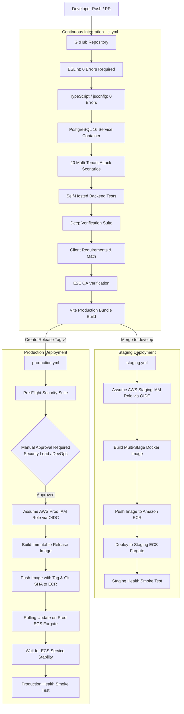

# JewelCore ERP — Production CI/CD Pipeline Architecture

**CI/CD Engine:** GitHub Actions  
**Authentication to AWS:** OpenID Connect (OIDC) — Zero Long-Lived Static Keys  
**Target Environments:** Staging (`develop` branch) & Production (`v*` tags with manual approval)  
**Security Rating:** Least Privilege IAM, Immutable Container Images, Automated Quality Gates  

---

## 1. CI/CD Workflow Pipeline Diagram



---

## 2. GitHub OIDC Security: Zero Static AWS Access Keys

Standard CI/CD setups often store `AWS_ACCESS_KEY_ID` and `AWS_SECRET_ACCESS_KEY` in GitHub Repository Secrets. This creates severe risk: if secrets leak, attackers gain persistent access to the cloud environment.

JewelCore strictly utilizes **GitHub OpenID Connect (OIDC)**:
1. GitHub Actions generates a short-lived JSON Web Token (JWT) signed by GitHub's token authority.
2. The workflow presents this token to AWS Security Token Service (`sts:AssumeRoleWithWebIdentity`).
3. AWS validates the token against an IAM Identity Provider configured for `token.actions.githubusercontent.com`.
4. AWS issues temporary STS credentials valid for 1 hour.
5. **Least Privilege IAM Role:** The role can ONLY push to the specific ECR repository and trigger ECS service updates for JewelCore. It cannot delete databases, create IAM users, or access other cloud resources.

### Trust Relationship Policy:
```json
{
  "Version": "2012-10-17",
  "Statement": [
    {
      "Effect": "Allow",
      "Principal": {
        "Federated": "arn:aws:iam::<ACCOUNT_ID>:oidc-provider/token.actions.githubusercontent.com"
      },
      "Action": "sts:AssumeRoleWithWebIdentity",
      "Condition": {
        "StringEquals": {
          "token.actions.githubusercontent.com:aud": "sts.amazonaws.com"
        },
        "StringLike": {
          "token.actions.githubusercontent.com:sub": "repo:organization/jewelcore-erp:*"
        }
      }
    }
  ]
}
```

---

## 3. Workflow File Specifications

### 3.1 `.github/workflows/ci.yml`
- **Triggers:** Every push and pull request targeting `main`.
- **Service Containers:** Spins up real `postgres:16-alpine` on port 5432.
- **Execution Matrix:**
  1. `npm run lint` (0 warnings/errors required)
  2. `npm run typecheck` (TypeScript strict mode)
  3. `npm run test:postgres` (10 database assertions)
  4. `npm run test:multitenancy` (20 multi-tenant penetration attack checks)
  5. `npm run test:backend` (16 core backend API checks)
  6. `npm run test:deep` (7 business logic checks)
  7. `npm run test:client` (8 financial calculation checks)
  8. `npm run test:qa` (10 comprehensive area checks)
  9. `npm run build` (Vite frontend production bundle)
- **Failure Behavior:** If any step fails, the pull request cannot be merged.

### 3.2 `.github/workflows/staging.yml`
- **Triggers:** Push to `develop` branch or manual dispatch.
- **Actions:** Runs full test suite, authenticates via OIDC, builds Docker image, pushes to ECR Staging, executes ECS rolling deployment, and pings `https://staging-api.jewelcore.in/api/health`.

### 3.3 `.github/workflows/production.yml`
- **Triggers:** Semantic version tags (`v1.0.0`, `v1.0.1`, etc.).
- **Protection:** Protected by GitHub Environment `production` with required reviewer approval.
- **Actions:** Pre-flight validation, ECR tag with both Git SHA and version tag, ECS zero-downtime rolling update (minimum 100%, maximum 200%), and post-deploy production smoke tests.
