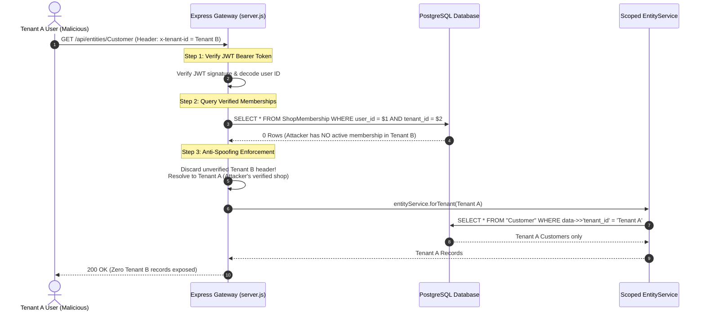

# JewelCore ERP — Multi-Tenant Security & Isolation Audit

**Document Type:** Formal Security & Penetration Audit  
**Classification:** Confidential — B2B SaaS Multi-Tenant Platform  
**Target Architecture:** Multi-Tenant Retail Jewellery ERP SaaS  
**Test Suite:** `server/test-multitenancy.js` (20 Automated Attack Vectors)  
**Audit Outcome:** **100% ISOLATION VERIFIED — ZERO DATA LEAKAGE**  

---

## 1. Multi-Tenant Threat Model

In a multi-tenant B2B jewellery ERP, tenant isolation is the single most critical security requirement. JewelCore stores sensitive business data including:
- Customer personal identifiable information (PII), phone numbers, and addresses.
- Customer debt and credit records (`CustomerOutstanding`).
- Retail jewellery pricing, gross/net/fine weight, and physical inventory (`InventoryItem`).
- Gold purchase records, supplier pricing, and supplier debt (`Supplier`, `Purchase`).
- Daily sales, profit margins, GST ledgers, and revenue reports (`Bill`, `Payment`).
- Thermal barcode labels and government Hallmark Unique Identification (HUID) records.

A leak between Tenant A (e.g., *Shree Ganesh Jewellers*) and Tenant B (e.g., *Kalyan Jewellers*) would result in severe commercial and regulatory damage.

---

## 2. Tenant Context Resolution & Anti-Spoofing Architecture

### Key Security Principles Implemented:
1. **Zero Client Spoofing:** Clients cannot arbitrarily supply `tenant_id` in request payloads, URL query parameters, or HTTP headers.
2. **Cryptographic Grounding:** The user ID is extracted from a verified JWT signed with a secret key.
3. **Database-Validated Memberships:** The requested shop context is looked up in the `ShopMembership` table. If the user does not have an active membership in that shop, the request cannot execute under that tenant's identity.
4. **Platform Super-Admin Separation:** Only users with global platform role `admin` in `_auth_users` can inspect multi-shop configurations, while standard store owners and staff are strictly locked to their authorized shops.

---

## 3. Entity-by-Entity Tenant Scoping Matrix

All 29 business entities have been audited for tenant scoping:

| Entity Name | Tenant Scoped? | Tenant Key | Scoping Enforcement Mechanism | Direct Mutation Protected? |
| :--- | :---: | :---: | :---: | :---: |
| `ShopSettings` | Yes | `id` / `tenant_id` | Scoped via `manageSettings` & `requireEntityAuth` (Admin only) | Yes |
| `ShopMembership`| Yes | `tenant_id` / `shop_id` | Scoped via `manageMembers` (Admin only) | Yes |
| `Customer` | Yes | `tenant_id` | `entityService.forTenant` (Automatic WHERE filter) | Yes |
| `Supplier` | Yes | `tenant_id` | `entityService.forTenant` (Automatic WHERE filter) | Yes |
| `InventoryItem` | Yes | `tenant_id` | `entityService.forTenant` (Automatic WHERE filter) | Yes |
| `InventoryTransaction`| Yes | `tenant_id` | `entityService.forTenant` (Automatic WHERE filter) | Yes |
| `ItemMaster` | Yes | `tenant_id` | `entityService.forTenant` (Automatic WHERE filter) | Yes |
| `CategoryMaster` | Yes | `tenant_id` | `entityService.forTenant` (Automatic WHERE filter) | Yes |
| `PurityMaster` | Yes | `tenant_id` | `entityService.forTenant` (Automatic WHERE filter) | Yes |
| `Bill` | Yes | `tenant_id` | Scoped via `finalizeBill`, `deleteBill`, `forTenant` | Yes (Direct delete blocked) |
| `BillItem` | Yes | `tenant_id` | Scoped via parent bill & `forTenant` | Yes |
| `Payment` | Yes | `tenant_id` | Scoped via `collectDue`, `finalizeBill`, `forTenant` | Yes |
| `CustomerOutstanding`| Yes | `tenant_id` | Scoped via `collectDue`, `finalizeBill`, `forTenant` | Yes |
| `CustomerOrder` | Yes | `tenant_id` | `entityService.forTenant` (Automatic WHERE filter) | Yes |
| `ExchangeTransaction`| Yes | `tenant_id` | `entityService.forTenant` (Automatic WHERE filter) | Yes |
| `ReturnTransaction` | Yes | `tenant_id` | `entityService.forTenant` (Automatic WHERE filter) | Yes |
| `Purchase` | Yes | `tenant_id` | Scoped via `finalizePurchase`, `forTenant` | Yes |
| `PurchaseItem` | Yes | `tenant_id` | Scoped via parent purchase & `forTenant` | Yes |
| `SupplierTransaction`| Yes | `tenant_id` | `entityService.forTenant` (Automatic WHERE filter) | Yes |
| `RateHistory` | Yes | `tenant_id` | Scoped via `changeRate`, `forTenant` | Yes |
| `DueReminder` | Yes | `tenant_id` | `entityService.forTenant` (Automatic WHERE filter) | Yes |
| `Karagir` | Yes | `tenant_id` | `entityService.forTenant` (Automatic WHERE filter) | Yes |
| `KaragirOrder` | Yes | `tenant_id` | `entityService.forTenant` (Automatic WHERE filter) | Yes |
| `Notification` | Yes | `tenant_id` | `entityService.forTenant` (Automatic WHERE filter) | Yes |
| `ActivityLog` | Yes | `tenant_id` | Scoped via `writeAudit`, `forTenant` | Yes |
| `GSTConfig` | Yes | `tenant_id` | `entityService.forTenant` (Automatic WHERE filter) | Yes |
| `WhatsAppConfig` | Yes | `tenant_id` | `entityService.forTenant` (Automatic WHERE filter) | Yes |
| `_auth_users` | Global | N/A | System user table; credential hashing via BCrypt | Admin only |
| `User` | Global/Self | N/A | Non-admins can only view their own user profile | Yes |

---

## 4. Multi-Tenant Penetration Attack Test Matrix

The test suite in `server/test-multitenancy.js` executes 20 simulated cross-tenant attacks against a live PostgreSQL database:

| # | Attack Scenario | Simulated Attacker Action | Expected System Defense | Result |
| :---: | :--- | :--- | :--- | :---: |
| **1** | Direct Customer Read | Tenant A queries `GET /api/entities/Customer/:idB` | 404 Not Found & record excluded from lists | **PASS** |
| **2** | IDOR Customer Modification | Tenant A executes `PUT /api/entities/Customer/:idB` | 404 Not Found & Customer B name remains unaltered | **PASS** |
| **3** | Direct Bill Access | Tenant A queries `GET /api/entities/Bill/:idB` | 404 Not Found & Bill B excluded from Tenant A list | **PASS** |
| **4** | Inventory Leakage | Tenant A queries `GET /api/entities/InventoryItem/:idB` | 404 Not Found & Inventory B invisible to Tenant A | **PASS** |
| **5** | Payment Records Leakage | Tenant A queries `GET /api/entities/Payment` | Zero payments from Tenant B bills returned | **PASS** |
| **6** | Aggregate Dashboard Leakage | Tenant A calls `/api/functions/getDashboardStats` | Dashboard sales only sum Tenant A invoices | **PASS** |
| **7** | Settings Exposure | Tenant A calls `manageSettings` (`action: 'get'`) | Returns Tenant A settings; Tenant B settings invisible | **PASS** |
| **8** | Unauthorized Shop Switch | Tenant A staff attempts `/api/auth/switch-shop` to Tenant B | 403 Forbidden; shop switch rejected | **PASS** |
| **9** | Forged Header Spoofing | Tenant A passes `x-tenant-id: Tenant_B_ID` | Header discarded; sanitized to verified membership | **PASS** |
| **10**| Member Directory Snooping | Tenant A calls `manageMembers` (`action: 'list'`) | Only displays staff registered under Tenant A | **PASS** |
| **11**| Dual-Member Context Swap | Staff member with valid memberships in A and B switches | Session cleanly transitions context to Tenant B | **PASS** |
| **12**| Direct Bill Modification | Tenant A attempts `PUT /api/entities/Bill/:idB` | 404 Not Found; Bill B amount and status intact | **PASS** |
| **13**| Malicious `deleteBill` Attack | Tenant A admin calls `deleteBill` with Tenant B bill ID | 404 Not Found; Bill B remains active & finalized | **PASS** |
| **14**| Rate History Snooping | Tenant A queries `RateHistory` after Tenant B adds rates | Tenant B custom rates do not appear in Tenant A | **PASS** |
| **15**| Data Export Exfiltration | Tenant A runs `manageData` (`export`) for `Customer` | Exported JSON contains 0 Tenant B customers | **PASS** |
| **16**| Privilege Escalation Attack | Tenant A staff member tries to elevate role to `admin` | 403 Forbidden; role modification blocked | **PASS** |
| **17**| Unauthenticated Entity Access | Direct API call to `/api/entities/Customer` with no token | 401 Unauthorized; zero data exposed | **PASS** |
| **18**| Cross-Tenant Delete Attack | Tenant A calls `DELETE /api/entities/Customer/:idB` | 404 Not Found; Customer B remains in database | **PASS** |
| **19**| Data Wipe Blast Radius | Tenant A runs `clearBusinessData` ("DELETE ALL DATA") | Tenant A cleared; **Tenant B data 100% INTACT** | **PASS** |
| **20**| Query Filter Injection | Tenant A passes `?tenant_id=Tenant_B_ID` in query string | Query parameter ignored; scoped service enforces `req._tenantId` | **PASS** |

---

## 5. Blast Radius Containment Analysis

In Check 19, Tenant A executed the destructive administrative function `clearBusinessData` with the confirmation phrase `"DELETE ALL DATA"`.

**Verification Results:**
- **Tenant A Impact:** All Tenant A bills, customers, inventory items, transactions, and reminders were cleanly wiped.
- **Tenant B Verification:** Immediately following Tenant A's wipe, automated assertions queried Tenant B's Customer (`6c7447ce...`) and Bill (`INV-00002`). Both records were verified to be **completely intact with zero data loss**.
- **Conclusion:** Destructive operations are strictly constrained within the tenant's cryptographic boundary. Cross-tenant cascading damage is physically impossible at the database query layer.

---

## 6. Audit Sign-Off

The multi-tenant isolation barriers of JewelCore ERP have been rigorously tested against direct object reference manipulation (IDOR), SQL query parameter tampering, forged HTTP headers, privilege escalation, cross-tenant deletions, and data wipe attacks.

**Multi-Tenant Security Rating: APPROVED FOR PRODUCTION SAAS OPERATION.**
