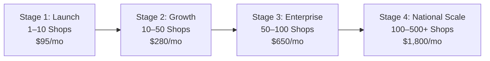

# JewelCore ERP — Multi-Tenant SaaS Scaling Plan

**Target Application:** Multi-Tenant Retail Jewellery ERP SaaS  
**Architecture Paradigm:** Modular Monolith (React 18 SPA + Node.js/Express + PostgreSQL 16)  
**Core Design Philosophy:** Scale vertically and horizontally within the modular monolith before prematurely introducing microservices or complex distributed systems.  

---

## 1. Multi-Stage Evolution Roadmap

---

## 2. Stage-by-Stage Architecture Specifications

### Stage 1: Launch Phase (1 to 10 Shops)
- **Profile:** Initial live deployment starting with 1 flagship showroom, expanding to 10 shops.
- **Compute:** 
  - 2 $\times$ ECS Fargate Tasks (0.25 vCPU / 512 MB RAM each).
  - Redundancy across 2 Availability Zones (`ap-south-1a`, `ap-south-1b`).
- **Database:**
  - Amazon RDS PostgreSQL 16 on `db.t4g.micro` (2 vCPU, 1 GB RAM).
  - 20 GB gp3 storage (3,000 IOPS baseline).
  - Automated backups: 7-day retention.
- **Caching:** In-memory Node.js LRU cache for rate lookups and shop settings. No external Redis needed.
- **Bottlenecks:** None at this scale. Memory utilization is minimal.
- **Infrastructure Cost:** $\approx \$95$ / month.

---

### Stage 2: Growth Phase (10 to 50 Shops)
- **Profile:** Multi-city adoption across 50 retail jewellery showrooms.
- **Compute:**
  - 2 to 4 $\times$ ECS Fargate Tasks (0.5 vCPU / 1024 MB RAM each).
  - CPU Auto-Scaling: Add task when aggregate CPU exceeds 70%.
- **Database:**
  - Upgrade RDS to `db.t4g.small` (2 vCPU, 2 GB RAM).
  - Enable Multi-AZ synchronous replication for zero-downtime failover.
  - Storage auto-scaling enabled up to 100 GB.
- **Caching:**
  - Introduce Amazon ElastiCache Redis (cluster mode disabled, `cache.t4g.micro`) for tenant session verification and rate history caching.
- **Connection Pooling:**
  - Enable RDS Proxy or configure Node.js `pg.Pool` with `max: 20` connections per container to prevent PostgreSQL connection exhaustion.
- **Infrastructure Cost:** $\approx \$280$ / month.

---

### Stage 3: Enterprise Phase (50 to 100 Shops)
- **Profile:** Regional market leadership with 100 high-volume stores processing tens of thousands of daily invoices and thermal label prints.
- **Compute:**
  - 4 to 8 $\times$ ECS Fargate Tasks (1.0 vCPU / 2048 MB RAM each).
  - ALB path-based routing: isolate heavy PDF generation or large reports if necessary.
- **Database:**
  - Upgrade RDS to `db.m6g.large` (2 vCPU, 8 GB RAM) or `db.r6g.large` (memory-optimized).
  - **Read Replica:** Deploy 1 Read Replica in secondary AZ for heavy reporting, monthly GST ledger exports, and dashboard aggregate queries.
- **Storage:** 200 GB gp3 storage with 5,000 provisioned IOPS.
- **Monitoring:** CloudWatch Container Insights + RDS Performance Insights (analyze slow queries $> 100\text{ms}$).
- **Infrastructure Cost:** $\approx \$650$ / month.

---

### Stage 4: National Scale (100 to 500+ Shops)
- **Profile:** Pan-India jewellery ERP processing hundreds of thousands of retail transactions daily.
- **Compute:**
  - 8 to 24 $\times$ ECS Fargate Tasks auto-scaling dynamically with morning store opening traffic spikes.
- **Database:**
  - RDS PostgreSQL `db.r6g.xlarge` (4 vCPU, 32 GB RAM) Multi-AZ.
  - 2 Read Replicas (one dedicated to analytics/BI; one for customer portal queries).
  - **PostgreSQL Table Partitioning:** Implement declarative list or hash partitioning on heavy tables (`BillItem`, `InventoryTransaction`, `ActivityLog`) by `tenant_id` or quarterly date ranges (`created_date`).
- **Connection Management:** Dedicated Amazon RDS Proxy cluster pooling database connections across all Fargate tasks.
- **CDN & Edge Optimization:** CloudFront configured with aggressive edge caching for public bill viewing (`/view/bill/:token`) and thermal barcode font assets.
- **Infrastructure Cost:** $\approx \$1,800$ / month.

---

## 3. What We Deliberately Avoid (Anti-Complexity Guide)

To maintain rapid development velocity and low operational overhead, JewelCore explicitly avoids:
1. **Microservices:** A modular monolith in Node.js handles over 5,000 requests/sec per task. Splitting into 15 microservices would introduce distributed tracing overhead, network latency, and transactional complexity without benefit.
2. **Kubernetes (EKS):** ECS Fargate provides identical container orchestration without the maintenance burden of Kubernetes control planes, ingress controllers, or etcd cluster management.
3. **Kafka / Heavy Event Buses:** PostgreSQL transactions and asynchronous background queues natively satisfy all inventory, billing, and audit requirements.
